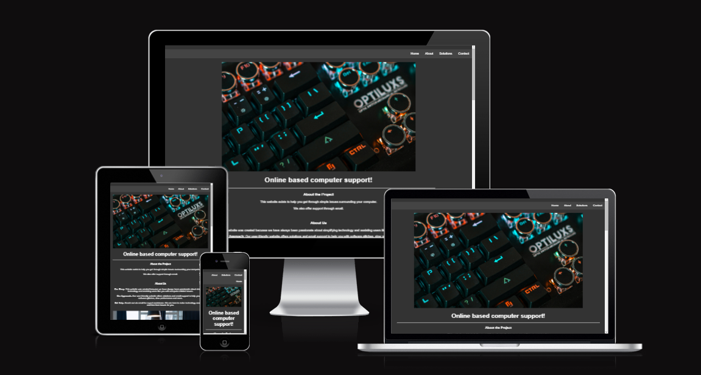

# PC Solutions Website

## Overview

Welcome to the PC Solutions website! This website provides valuable information and resources to help users troubleshoot and resolve common computer issues, both software and hardware related.

## Table of Contents
- [Features](#features)
- [Usage](#usage)
- [Accessibility](#accessibility)
- [credits](#credits)

## Features

- **Common Solutions:** Find solutions to the most common software and hardware problems encountered by computer users.
- **Gallery:** Explore a gallery of computer software, hardware, and service categories.
- **Contact Us:** Get in touch with our team for personalized support through our contact form.

## Usage

To access the website, simply navigate to [PC Solutions](https://pontaaaa.github.io/PC-Solutions/).

### Common Solutions

Browse through our collection of common solutions to troubleshoot and resolve various computer issues.

### Gallery

Explore our gallery, which is categorized into Software, Hardware, and Services, to find useful information and resources related to each category.

### Contact Us

If you need personalized assistance or have specific questions about your computer issues, feel free to contact us using the provided contact form on the website.

### Accessibility

Our website scored:

72 on Performance. 94 on Accessibility. 100 on Best practices. 100 on SEO.

### Credits

Code:
Informational help from https://www.w3schools.com

Media:
Images and video from: https://www.pexels.com 
Favicon from: https://icons8.com
