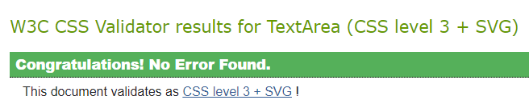
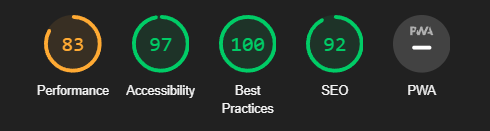

# PC Solutions Website

## Overview

Welcome to the PC Solutions website! This website provides valuable information and resources to help users troubleshoot and resolve common computer issues, both software and hardware related.

## Features

### Existing Features

- **About Us** Small section of quick information to be informed about the website.
- **Common Solutions** Information about the most common solutions, for both software and hardware issues.
- **Contact Us** Email submition form, in case more informational help is required.

## Technologies Used

- HTML
- CSS

## Testing

The website has been validated using W3C Markup Validator and W3C CSS Validator.

* [W3C Markup Validtor](https://validator.w3.org/)
* [W3C CSS Validator](https://jigsaw.w3.org/css-validator/)

### Results

-HTML
    -No errors were returned after passing through W3C HTML Validator.
-CSS
    -No errors were returned after passing through W3C CSS Validator

-Lighthouse
    -The website recived the scores:
        83 on Performance
        97 on Accessibility
        100 on Best Practices
        92 on SEO

### Manual Testing

This website has been tested and worked on using both smaller and bigger screen sizes.

The website smoothly transitions and converts according to the screen size, allowing for a comfortable experinces on all devices.

## Deployment

You can enter the website by visiting [here](https://pontaaaa.github.io/PC-Solutions/).

- The site was deployed to GitHub pages. The steps to deploy are as follows: 
  - In the GitHub repository, navigate to the Settings tab 
  - From the source section drop-down menu, select the Master Branch
  - Once the master branch has been selected, the page will be automatically refreshed with a detailed ribbon display to indicate the successful deployment. 

The live link can be found here - https://github.com/Pontaaaa/PC-Solutions

## Credits

Code:
Informational help from https://www.w3schools.com

## Media

Media:
Images and video from: https://www.pexels.com 
Favicon from: https://icons8.com
